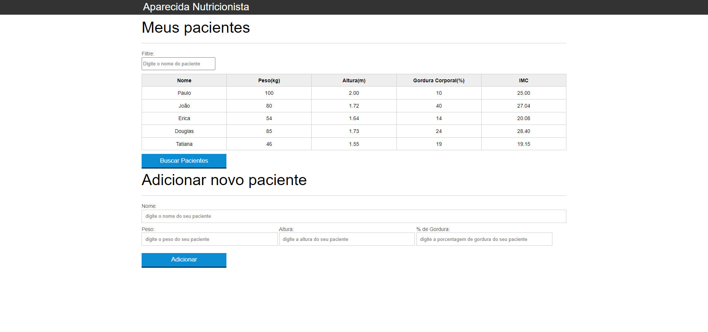
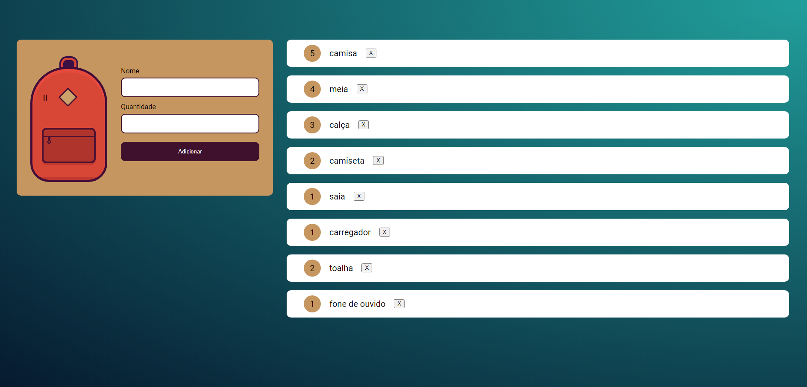

# Projetos JavaScript Alura 
  
## Projeto 1: 

Curso: JavaScript: programando na linguagem da web

<b>Aparecida Nutricionista</b> 

Funcionalidades do site:

<ul>
<li>Filtrar pacientes</li>
<li>Adicionar pacientes</li>
<li>Excluir pacientes com duplo clique</li>
<li>Mensagens de erro ao digitar dados incorretos</li>
<li>Calculo automático de IMC</li>
<li>Busca de novos pacientes com AJAX</li>
</ul>

## Projeto 2:

Curso: JavaScript na Web: armazenando dados no navegador

<b>Mochila de Viagem</b> 

Funcionalidades do site:

<ul>
<li>Adicionar itens com armazenamento no Local Storage</li>
<li>Atualizar a quantidade de itens existentes na lista e no LS</li>
<li>Excluir itens da lista e do LS</li>
</ul>
